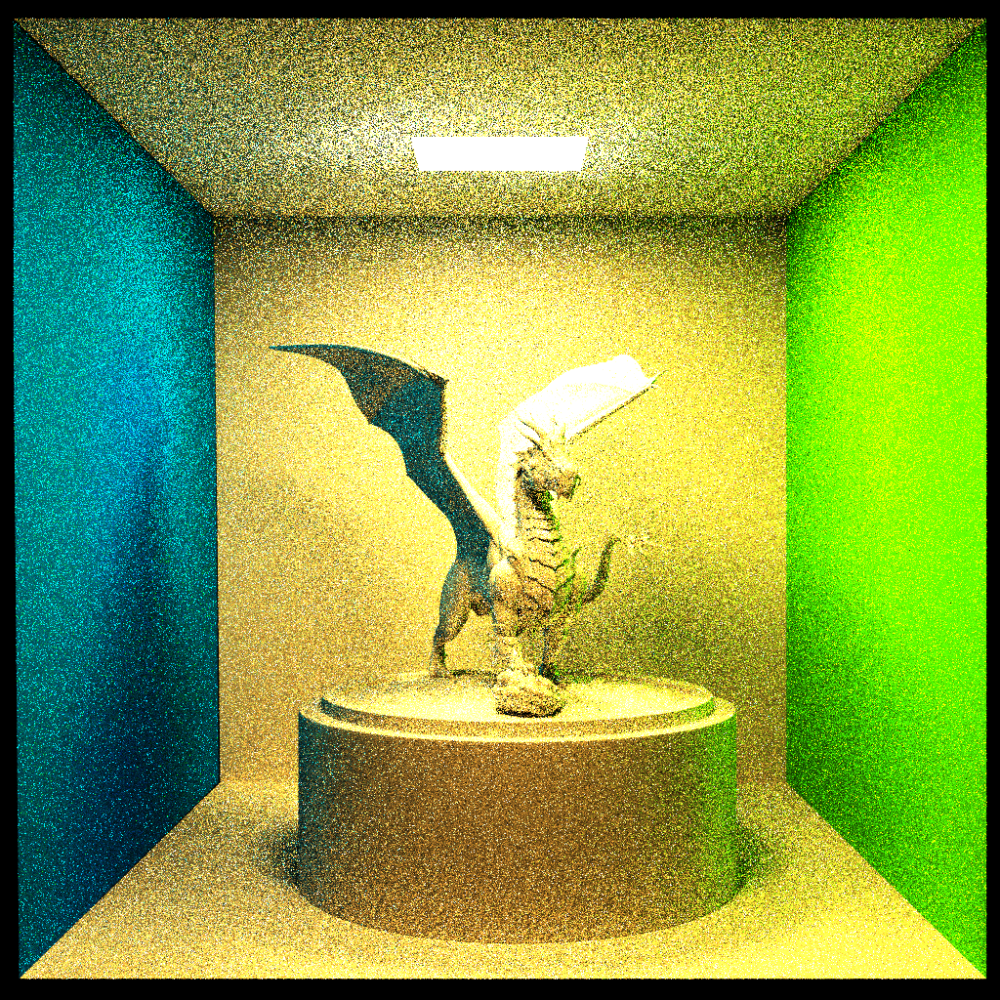

# Simple Render Engine

[](https://wakatime.com/badge/github/Zhytou/SimpleRenderEngine)

- [Simple Render Engine](#simple-render-engine)
  - [简介](#简介)
  - [原理](#原理)
    - [路径追踪](#路径追踪)
    - [光照模型](#光照模型)
  - [优化](#优化)
    - [OpenMP 并行加速](#openmp-并行加速)
    - [直接光照](#直接光照)
    - [BVH 加速](#bvh-加速)
  - [TODO List](#todo-list)
  - [参考](#参考)

## 简介

**开发环境**：WSL Ubuntu22.04.2 + VSCode + CMake + OpenCV + OpenMP

> 下载OpenCV可以参考其[官网手册](https://docs.opencv.org/4.x/d7/d9f/tutorial_linux_install.html)

**项目结构**：

```bash
.
├── CMakeLists.txt
├── README.md
├── build // 编译文件夹
├── example // 测试模型及说明文件夹
├── include // 头文件
│   ├── AABB.hpp
│   ├── BVH.hpp
│   ├── Camera.hpp
│   ├── Hittable.hpp
│   ├── Light.hpp
│   ├── Material.hpp
│   ├── Random.hpp
│   ├── Ray.hpp
│   ├── Texture.hpp
│   ├── Trace.hpp
│   ├── Triangle.hpp
│   └── Vec.hpp
├── res // 结果及报告文件夹
├── src // 源码
│   ├── AABB.cpp
│   ├── BVH.cpp
│   ├── Camera.cpp
│   ├── Light.cpp
│   ├── Material.cpp
│   ├── Random.cpp
│   ├── Ray.cpp
│   ├── Texture.cpp
│   ├── Trace.cpp
│   ├── Triangle.cpp
│   └── main.cpp
├── test // 测试
│   ├── hitTest.cpp
│   ├── materialTest.cpp
│   ├── reflectTest.cpp
│   └── refractTest.cpp
├── test.sh // 测试脚本
└── third-parties // 三方库（tinyobjloader）
```

**编译&运行**：

```bash
# 运行测试脚本
bash test.sh

# 使用CMake编译
mkdir build
cd build
cmake ../
# 渲染康奈尔盒模型
make main
./main ../example/cornell-box/ cornell-box.obj cornell-box.xml
```

**渲染效果**：

- 片元数量234945
- SSP 10
- 1024*1024
- 渲染时间：25min



## 原理

### 路径追踪

路径追踪的基本原理是由相机从场景中发送光线而模拟光线在三维场景中的传播和交互过程，计算出每个像素点上的颜色和亮度值。
一般来说，一个基础的路径追踪流程如下：

- 相机向屏幕中每一个像素点投射光线；
- 光线进入场景，若未命中场景中物品，则直接返回；若命中场景中物品，则依次计算直接光照、间接光照和自发光。
  - 计算直接光照，可以直接采样光源。即随机从光源中取一点，判断该点和原碰撞点连线是否有障碍物阻隔。若无阻隔，则使用下面的公式计算直接光照`L_dir = E * cos(-ws, NN) * cos(ws, N) / (dis *dis * pdfLight)`。其中，ws代表光源采样点与原碰撞点的连线方向，NN代表光源法向量，N代表原碰撞点处法向量，dis代表连线长度，pdfLight代表光源面积。
  - 计算间接光照。首先执行俄罗斯轮盘，仅当随机概率低于设置的阈值后，才进行下一步计算。接着根据物品材质分别计算漫反射、镜面反射或折射，并进入下一轮路径追踪。其中，针对漫反射情况，我们采用了蒙特卡洛积分的思想，取一球面随机向量作为递归的光线，只需在该路径追踪返回值除以 pdf（1/2\*pi）即可。（详细理论可参考此[博客](https://blog.csdn.net/weixin_44176696/article/details/113418991)）
  - 至于自发光，只需要使用碰撞点材质的getEmission函数获取即可。
- 最后，为了提高图像画质，我们可以向屏幕中每一个像素点投射多条光线。这个值也被称为 Sample Pre Pixel，简称 SSP。

因此，蒙特卡洛的思想主要用在两个地方。一是由相机朝某像素点射入多条路径；二是计算间接光照的漫反射情况时。

### 光照模型

光照模型是一种用于描述物体在不同光照条件下表现的方法。它包含了描述物体表面反射和折射特性的材料属性，以及描述光源和环境光照强度的光源属性，以计算最终的颜色值。
本实验采用的是冯氏光照模型，关于冯氏模型的介绍可以参考此[网站](https://learnopengl-cn.readthedocs.io/zh/latest/02%20Lighting/02%20Basic%20Lighting/)。

简单来说，冯氏光照模型将物体发出的光分成了三个部分：自发光、漫反射光和镜面反射光（镜面反射光也被称为高光）。其中，漫反射光受物体的漫反射衰减参数（Kd）影响，而镜面反射光则受物体的高光衰减系数（Ks）影响。本实验中，这些参数由模型的 mtl 文件提供。因此，我们只需要使用[tinyobjloader](https://github.com/tinyobjloader/tinyobjloader/tree/release)读取并将这些参数存入相应的 Material 对象即可。

## 优化

### OpenMP 并行加速

由于每个像素的值是相互独立的，因此可以使用 OpenMP 并行库进行加速。

### 直接光照

为了减少递归超过最大深度，光线也没有命中光源的概率，我们可以使用光源重要性采样，即：每命中一个物体，就尝试判断光源是否可以命中该交点（连线无障碍），若可命中，则可将光源强度添加至直接光照中。

### BVH 加速

BVH 盒全称是 Bounding Volume Hierarchies，即层次包围盒。这里我们先不直接讲它的原理，我们先来回忆一下之前的内容：当我们要开始求交的时候，我们需要拿到 hittable_list，然后逐个遍历每个物体。这样我们的求交复杂度是 O(n)，当场景较为庞大，三角面的数量达到十万、百万级别的时候，求交会变成一个极其吃力的事情。因此，我们需要将求交的复杂度进一步降低。

## TODO List

- [x] Baisc path tracing
  - [x] Phong lighting
  - [x] Camera(perspective and orthographic)
  - [x] OBJ load/Triangle mesh/Material
- [x] Optimization
  - [x] OpenMP acceleration
  - [x] Direct lighting
  - [ ] Importance sampling(using cosine)
  - [x] BVH acceleration
- [x] Texture support
- [ ] Benchmark
- [ ] More acceleration(e.g. CUDA)

## 参考

- [光照模型](https://learnopengl-cn.readthedocs.io/zh/latest/02%20Lighting/02%20Basic%20Lighting/)
