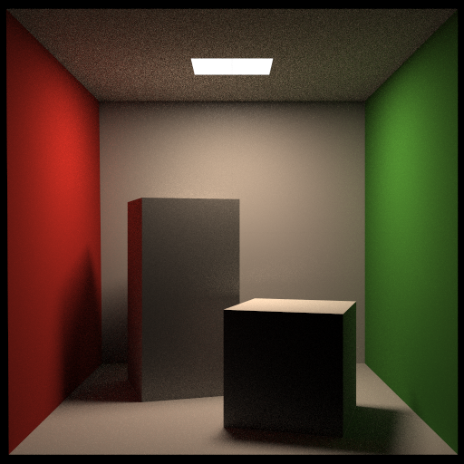
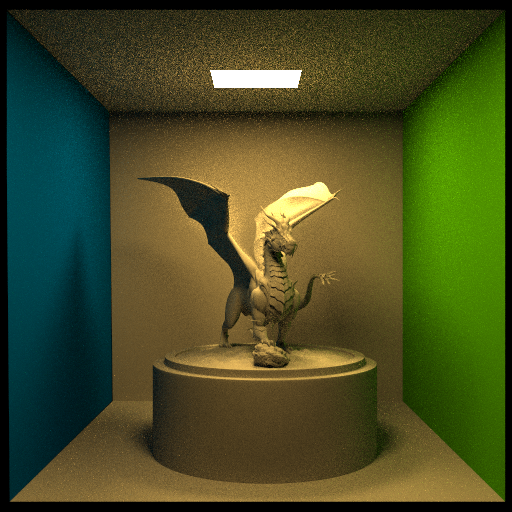

# Simple Path Tracer

[](https://wakatime.com/badge/github/Zhytou/SimpleRenderEngine)

- [Simple Path Tracer](#simple-path-tracer)
  - [简介](#简介)
  - [原理](#原理)
    - [路径追踪](#路径追踪)
    - [光照模型](#光照模型)
  - [优化](#优化)
    - [OpenMP 并行加速](#openmp-并行加速)
    - [直接光照](#直接光照)
    - [BVH 加速](#bvh-加速)
  - [参考](#参考)

## 简介

**编译运行**：

```bash
# 克隆项目
git clone git@github.com:Zhytou/SimplePathTracer.git

# 下载第三方库
git submodule update --init

# 使用CMake编译
mkdir build
cd build
cmake ../

# 渲染康奈尔盒模型
make main
./main
```

**渲染效果**：

- 片元数量32
- SPP 256
- 512*512
- 渲染时间：709s



- 片元数量234945
- SPP 128
- 512*512
- 渲染时间：5324s



## 原理

### 路径追踪

路径追踪的基本原理是由相机从场景中发送光线而模拟光线在三维场景中的传播和交互过程，计算出每个像素点上的颜色和亮度值。
一般来说，一个基础的路径追踪流程如下：

- 相机向屏幕中每一个像素点投射光线；
- 光线进入场景，若未命中场景中物品，则直接返回；若命中场景中物品，则依次计算直接光照、间接光照和自发光。
  - 计算直接光照，可以直接采样光源。即随机从光源中取一点，判断该点和原碰撞点连线是否有障碍物阻隔。若无阻隔，则使用下面的公式计算直接光照`L_dir = E * cos(-ws, NN) * cos(ws, N) / (dis *dis * pdfLight)`。其中，ws代表光源采样点与原碰撞点的连线方向，NN代表光源法向量，N代表原碰撞点处法向量，dis代表连线长度，pdfLight代表光源面积。
  - 计算间接光照。首先执行俄罗斯轮盘，仅当随机概率低于设置的阈值后，才进行下一步计算。接着根据物品材质分别计算漫反射、镜面反射或折射，并进入下一轮路径追踪。其中，针对漫反射情况，我们采用了蒙特卡洛积分的思想，取一球面随机向量作为递归的光线，只需在该路径追踪返回值除以 pdf（1/2\*pi）即可。（详细理论可参考此[博客](https://blog.csdn.net/weixin_44176696/article/details/113418991)）
  - 至于自发光，只需要使用碰撞点材质的getEmission函数获取即可。
- 最后，为了提高图像画质，我们可以向屏幕中每一个像素点投射多条光线。这个值也被称为 Sample Pre Pixel，简称 SPP。

因此，蒙特卡洛的思想主要用在两个地方。一是由相机朝某像素点射入多条路径；二是计算间接光照的漫反射情况时。

### 光照模型

光照模型是一种用于描述物体在不同光照条件下表现的方法。它包含了描述物体表面反射和折射特性的材料属性，以及描述光源和环境光照强度的光源属性，以计算最终的颜色值。
本实验采用的是冯氏光照模型，关于冯氏模型的介绍可以参考此[网站](https://learnopengl-cn.readthedocs.io/zh/latest/02%20Lighting/02%20Basic%20Lighting/)。

简单来说，冯氏光照模型将物体发出的光分成了三个部分：自发光、漫反射光和镜面反射光（镜面反射光也被称为高光）。其中，漫反射光受物体的漫反射衰减参数（Kd）影响，而镜面反射光则受物体的高光衰减系数（Ks）影响。本实验中，这些参数由模型的 mtl 文件提供。因此，我们只需要使用[tinyobjloader](https://github.com/tinyobjloader/tinyobjloader/tree/release)读取并将这些参数存入相应的 Material 对象即可。

## 优化

### OpenMP 并行加速

由于每个像素的值是相互独立的，因此可以使用 OpenMP 并行库进行加速。

### 直接光照

为了减少递归超过最大深度，光线也没有命中光源的概率，我们可以使用光源重要性采样，即：每命中一个物体，就尝试判断光源是否可以命中该交点（连线无障碍），若可命中，则可将光源强度添加至直接光照中。

### BVH 加速

在光线追踪中，BVH（Bounding Volume Hierarchies）是一种至关重要的空间划分数据结构，用于加速场景中物体的碰撞检测。在计算每个像素的最终颜色时，我们需要测试大量光线与场景中物体的交点。如果没有有效的加速机制，这个过程会非常耗时，尤其是在处理复杂场景时。

BVH的基本原理是将场景中的物体包围在一系列的包围盒（如轴对齐包围盒AABB）内，并构建一个层次的树状结构。在树的每个内部节点，都包含其子节点所代表的物体集合的包围盒。通过这个层次结构，我们可以快速地剔除大量不可能相交的光线和物体，从而减少需要进行精确交点测试的次数。在查询时，我们从根节点开始，通过比较光线与包围盒的交点来决定是进入左子树还是右子树，以此类推，直到找到一个可能的交点或者遍历完整棵树。

通过使用BVH，我们可以显著减少光线追踪的计算量，提高渲染速度，同时保持高质量的图像输出。这对于实时渲染和大规模场景的处理至关重要，使得后续的开发者能够更高效地理解和优化代码。

## 参考

- [光照模型](https://learnopengl-cn.readthedocs.io/zh/latest/02%20Lighting/02%20Basic%20Lighting/)
