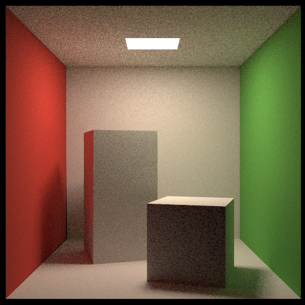
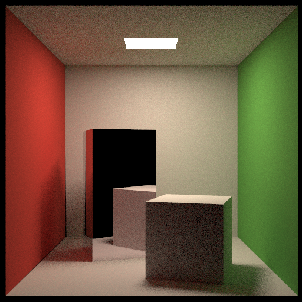
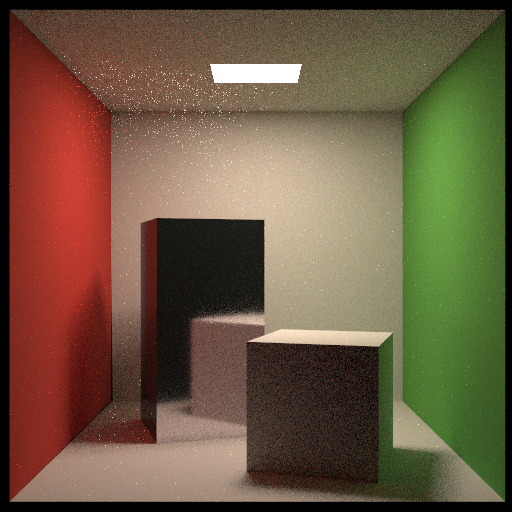
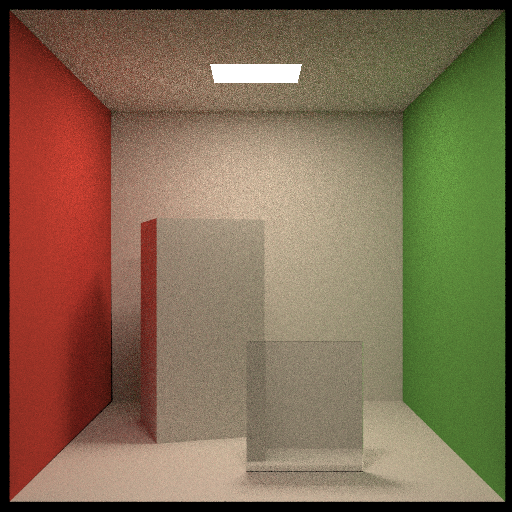
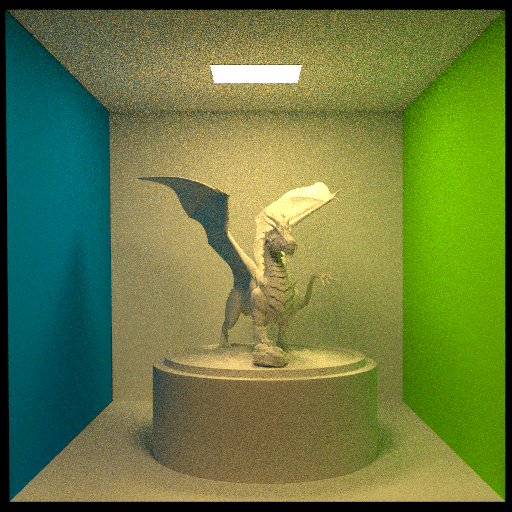

# Simple Path Tracer

[](https://wakatime.com/badge/github/Zhytou/SimplePathTracer)

**编译运行**：

```bash
# 克隆项目
git clone git@github.com:Zhytou/SimplePathTracer.git

# 下载第三方库
git submodule update --init

# 使用CMake编译
mkdir build
cd build
cmake ../

# 渲染康奈尔盒模型
make main
./main
```

**渲染效果**：












