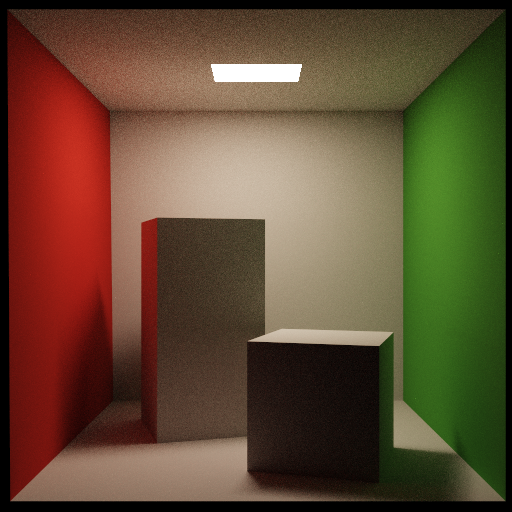
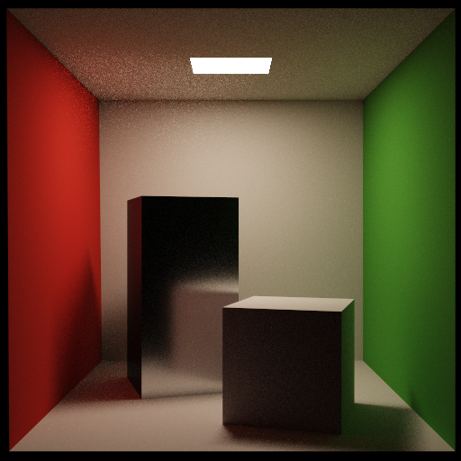
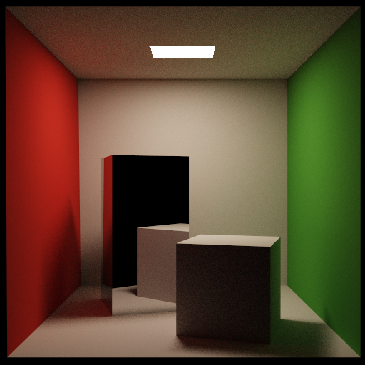
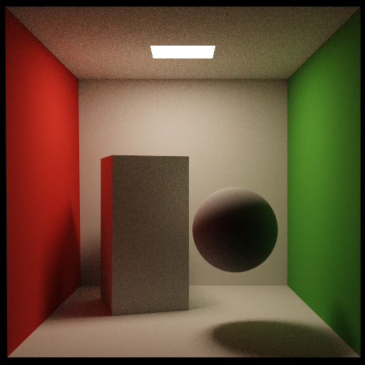
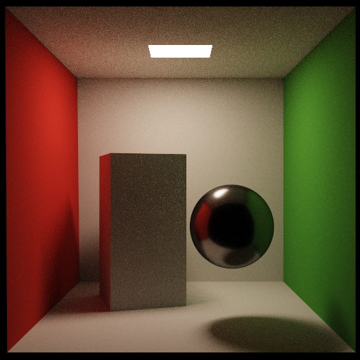
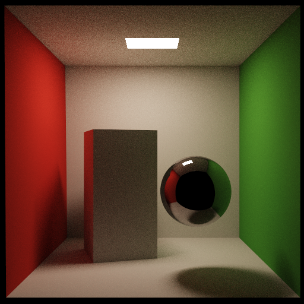
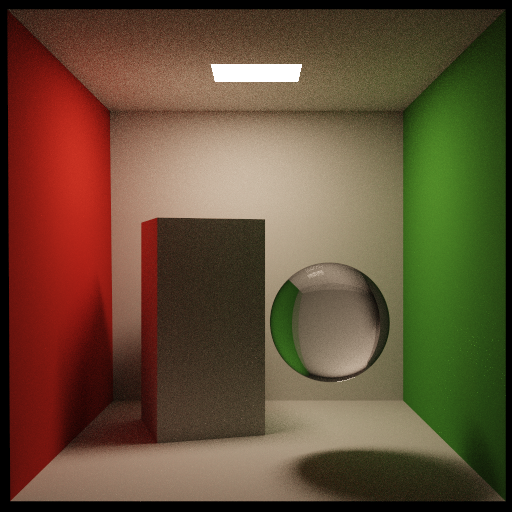
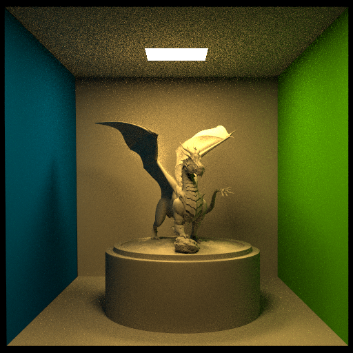
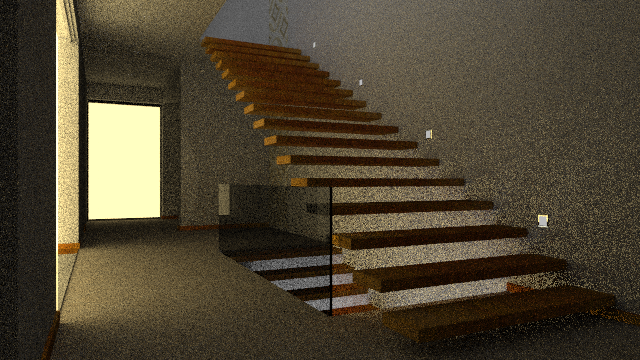

# Simple Path Tracer

> A modern, lightweight, physically based CPU Path Tracer built with C++20.

[](https://wakatime.com/badge/github/Zhytou/SimplePathTracer)

## 📸 Showcases

| Diffuse Cuboid | Glossy Cuboid | Metal Cuboid |
| :---: | :---: | :---: |
|  |  |  |

| Diffuse Sphere | Glossy Sphere | Metal Sphere | Glass Sphere |
| :---: | :---: | :---: | :---: |
|  |  |  |  |

---

**More Examples**:






## ✨ Main Features

- 💎 **微表面物理材质模型 (PBR Microfacet Material)**
  - 基于 **Cook-Torrance BRDF**，完整包含 **GGX (Trowbridge-Reitz)** 法线分布函数与 **Smith-GGX** 几何遮蔽/阴影函数。
  - 支持 **Diffuse（漫反射）**、**Glossy（光泽反射）**、**Specular（纯镜面）**、**Glass/Transmission（玻璃透射与全内反射 TIR）**。
- 🎲 **重要性采样与数值收敛 (Importance Sampling & MIS)**
  - **GGX 半角向量采样**：针对 Glossy 粗糙表面进行高效高光采样，大幅降低微表面高光噪点。
  - **Cosine-Weighted 半球采样**：针对 Diffuse 表面进行标准 Cosine 权重采样。
  - **显式光源采样 (Next Event Estimation, NEE)** 与 **多重重要性采样 (MIS)**：混合光源采样与 BSDF 采样，完美解决 Veach-MIS 等经典强对比光源场景。
- ⚡ **现代 C++20 架构与基础设施**
  - **自研极简向量数学库 (`Vec`)**：提供高效的三维/二维向量加减、点乘、叉乘、归一化、插值与随机生成接口，零冗余依赖。
  - **Fluent BoxLogger**：自研轻量级流式格式化日志库，支持 C++ 流式调用 (`<<`)、自动化控制台/文件排版输出以及 Debug 源码位置追踪 (`__FILE__`, `__LINE__`)。

---

## Build & Run

```bash
# 克隆项目
git clone git@github.com:Zhytou/SimplePathTracer.git

# 下载第三方库
git submodule update --init

# 使用CMake编译
mkdir build
cd build
cmake ../

# 渲染康奈尔盒模型
make main
./main
```
